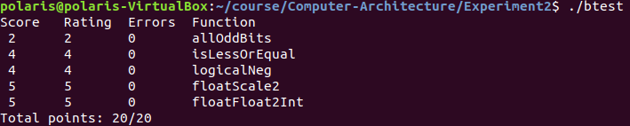

# 实验 2 实验报告

余北辰 519030910245

## 1.make

在实验报告中回答以下问题:

* _本程序的编译使用哪个编译器？_

    `gcc`

* _采用哪个命令，可以将所有程序全部编译？_

    `$ make all`

* _采用哪个命令，可以将所有上次编译的结果全部删除？_

    `$ make clean`

* _文件中第几行生成 btest 的目标文件？_

    第11行

* _文件中第几行生成 fshow 的目标文件？_
  
    第14行

* _如果在 Makefile 文件中用要引用变量“FOO“， 怎么表示？_
  
    `$(FOO)`
## 2.位级运算、数的编码

下面给出我写的函数源码：

_1.allOddBits_

```c
int allOddBits(int x)
{
   int ans;
   const int all_odd_1 = 0xaaaaaaaa;
   int x_oddbits = all_odd_1 & x;
   ans = !(all_odd_1 ^ x_oddbits);
   return ans;
}
```

_2.isLessOrEqual_

```c
int isLessOrEqual(int x, int y)
{
   int ans;
   int not_equal = x ^ y;
   int x_flag = x >> 31 & 1;
   int y_flag = y >> 31 & 1;
   int flag_not_equal = x_flag ^ y_flag;
   int minus = x + (~y + 1);
   int minus_flag = minus >> 31;
   ans = (!not_equal) | (flag_not_equal & x_flag) | ((!flag_not_equal) & minus_flag);
   return ans;
}
```

_3.logicalNeg_

```c
int logicalNeg(int x)
{
   int ans;
   int neg = ~x + 1;
   int equal_to_neg = !x ^ neg;
   int is_not_int_min = !(x << 31);
   ans = equal_to_neg & is_not_int_min;
   return ans;
}
```
_4.floatScale2_

```c
unsigned floatScale2(unsigned uf)
{
   unsigned ans;
   unsigned e = (uf & 0x7f800000) >> 23;
   unsigned s = uf >> 31;
   unsigned m = uf & 0x007fffff;
   if (e == 0xff)
      return uf;
   if (e == 0)
   {
      if (m == 0)
         return uf;
      if (m & 0x00400000)
         e++;
      m <<= 1;
      m &= 0x007fffff;
   }
   else
   {
      e++;
      if (e == 0xff)
         m = 0;
   }
   ans = (s << 31) | (e << 23) | m;
   return ans;
}
```

_5.floatFloat2Int_

```c
int floatFloat2Int(unsigned uf)
{
   int ans;
   int false_num = 0x80000000u;
   unsigned bias = 0x7f;
   unsigned e = (uf & 0x7f800000) >> 23;
   unsigned s = uf >> 31 & 1;
   unsigned m = uf & 0x007fffff;
   if (e == 0xff || e >= bias + 31)
      return false_num;
   else if (e < bias)
      return 0;
   else
   {
      if (e - bias > 23)
         ans = (m | 0x00800000) << (e - bias - 23);
      else
         ans = (m | 0x00800000) >> (23 - (e - bias));
   }
   if (s)
      ans = ~ans + 1;
   return ans;
}
```

下面是得分情况的截图：
