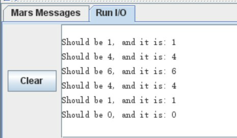

# 实验3MIPS汇编语言
余北辰519030910245

## 一、熟悉MARS

**1. 	.data,.word,.text指令的含义是什么？（即：它们的用途是什么？）**

.data代表“以下是数据段，进行变量声明”；
.word代表“声明word类型的变量，并为它分配空间”
.text代表“以下是代码段”

**2.	如何在MARS中设置断点？在第14行设置断点并运行至此。指令的地址是什么？第14行是否执行？**

勾选想要设置断点所在行前的“Bkpt”框，既可在此行设置断点。
指令的地址是0x00400020。
第14行不执行，而在此行中停下。

**3.	如果在断点处，如何继续运行你的代码？如何单步调试你的代码？将代码运行至结束。**

使用“Go”工具继续运行代码。
使用“Step”工具进行单步执行。

**4.	找到“RunI/O”窗口.程序输出的数字是什么？如果0是第0个斐波那契数，那么这是第几个斐波那契数？**

输出的数字是34。
这是第9个斐波那契数。

**5.	在内存中，n存储在哪个地址？尝试通过（1）查看DataSegment，以及（2）查看机器代码（TextSegment中的Code列）理解，如何从存储器中读取n。**

n储存在0x10010010处。

**6.	如何在不改变“Edit”栏下的代码的条件下，通过在执行前手动修改存储位置的值，让程序计算第13个斐波那契数（索引从0开始）？你可以取消勾选DataSegment底部的“HexadecimalValues”框方便观察。**

在DataSegment中将地址为0x10010010处的值9(D)改为13(D)。

**7.	如何观察和修改一个寄存器中的值？重置模拟（Run→Reset）并通过（1）在一个设置好的断点停下，（2）只修改一个寄存器，（3）解除断点，来计算第13个斐波那契数。**

在第11行设置断点，把$t3寄存器的值9(D)改为13(D)，然后解除断点运行。

**8.	第19行和第21行用到了syscall指令。它是什么？如何使用它？（提示：可以查看MARS的Help菜单）**

实现终端的输入输出，以及声明程序结束。通过设置$v0寄存器的值，来决定终端输入输出的类型或者退出程序。

## 二、将C编译为MIPS

**1.	在生成的MIPS汇编代码lab3_ex2.s中找到将source复制到dest的循环部分所对应的指令。**

即$L3所对应的部分。
```psasm
$L3:
	sw	$4,0($3)
	lw	$4,0($2)
	addiu	$3,$3,4
	addiu	$2,$2,4
	bne	$4,$0,$L3
	nop
```

**2.	找到lab_ex2.c中的source和dest指针最初在汇编文件中存储的位置。最后，解释这些指针是如何通过循环进行操作的。**

source指针指向的地址储存在\$2中，dest指针指向的地址储存在\$3中。

在\$L3中，先通过sw操作将\$3中的地址保存在\$4中，再通过lw操作把\$4中的地址取到\$2中去，这样就把source的指针指向的地址复制到dest指针指向的地址去。

之后\$2和\$3的地址都加4，代表数组中下一个元素的地址。

再通过bne指令判断\$4中的值是否为0，如果为0说明已经到了数组的末尾，跳出循环。否则继续进行循环。

## 三、函数调用的过程

运行结果如图：


函数源代码如下：


```
#calculateC($a0,$a1)
nchoosek:
	#prologue
	###YOURCODEHERE###
	addi	$sp,$sp,-24
	sw	$s2,20($sp)
	sw	$s1,16($sp)
	sw	$s0,12($sp)
	sw	$ra,8($sp)
	sw	$a1,4($sp)
	sw	$a0,0($sp)
	
	beq	$a1,$0,return1
	beq	$a0,$a1,return1
	beq	$a0,$0,return0
	blt	$a0,$a1,return0
	
	
	addi	$a0,$a0,-1		#C(n,k)=C(n-1,k)+C(n-1,k-1)
	move	$s0,$a0
	move	$s1,$a1
	
	jal	nchoosek
	
	move	$s2,$v0
	move	$a0,$s0
	addi	$a1,$s1,-1
		
	jal	nchoosek
	
	add	$v0,$v0,$s2
	
	j	return
return0:
	move	$v0,$0
	j	return
return1:
	addi	$v0,$0,1

return:
	#epilogue
	###YOURCODEHERE###
	lw	$a0,0($sp)
	lw	$a1,4($sp)
	lw	$ra,8($sp)
	lw	$s0,12($sp)
	lw	$s1,16($sp)
	lw	$s2,20($sp)
	addi	$sp,$sp,24
	jr	$ra
```