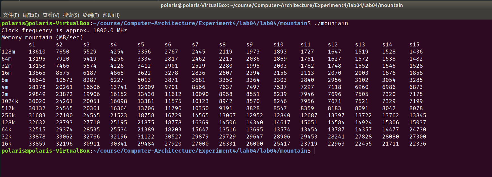
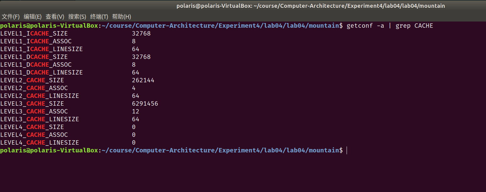

# 实验4 高速缓存的性能
余北辰519030910245

## Exercise 1: Cache Visualization

### 场景1

* cache命中率是多少？

命中率为0%。


* 为什么会出现这个cache命中率？

cache采取直接映射的方式；循环每重复一次，会访问四个地址；由于采取直接映射的方式，每访问两个地址就发生一次冲突，cache发生置换，因此每次访问都会发生cache miss。


* 增加Rep Count参数的值，可以提高命中率吗? 为什么?

不可以，因为一直会发生cache miss。


* 为了最大化hit rate，在不修改cache参数的情况下，如何修改程序中的参数（program parameters）？

将Option的值改为1，因为这样在读操作发生cache miss后，写操作能cache hit。


### 场景2

* Cache 命中率是多少？

命中率为75%。


* 为什么会出现这个cache命中率？

由于一块是4个word，也就是16个Byte，等于4个int型数据的大小。也就是说每次cache miss后，会将连续的四个int型数据写入cache。 而step size为2，且option的值为1，也就是说每四次访问的内容都在一个块中。其中第一次会发生miss，之后三次都是hit，所以命中率是75%。


cache采取四路组相联映射的方式，因此一共有4个组，组号为2位。因此每经过$2^{4+2}=64$个bytes,也就是16个int型数据，会出现一次组号相同的情况。而Array Size为256Bytes，也就是说一共有64个int型数据；而cache中一组也正好有4块，因此所有的数据正好将cache给填满，不用发生替换。因此最终的命中率就是75%。


* 增加Rep Count 参数的值，例如重复无限次，命中率是多少? 为什么?

会不断接近100%,重复无数次后命中率就为100%。因为一次循环后，正好将所有的数据全部写进了cache，之后每次访问都会发生cache hit。

## Exercise 2: Loop Ordering and Matrix Multiplication

* 1000-1000的矩阵相乘，哪种嵌套顺序性能最好？哪种嵌套顺序性能最差？

ikj嵌套顺序性能最好；jki嵌套属性性能最差；


* 教材《深入理解计算机系统》（CSAPP3e中文版P449）分析了6个版本的矩阵乘法最内层循环中的cache miss次数，如下图所示。和你观察到的结果一致吗？最内层循环中数据访问的步长是怎么影响性能的？

我观察到的结果与之一致。最内层循环中数据访问的步长越小，由局部性原理，cache miss的概率也就越小，性能也就越高。


* 参考如下代码（CSAPP3e中文版P448），修改matrixMultiply.c，再次观察程序的性能是否有改善（浮点运算吞吐率Gflops/s），从中你得到哪些经验？

将最内层循环中的不改变的元素的值用变量储存。减少了访问次数，因此也能改善程序的性能。


* 教材《深入理解计算机系统》（CSAPP3e中文版P449）在Intelcore i7处理器上分析了6个版本的矩阵乘法的性能，可以发现：当矩阵大小为700*700时，最快的版本比最慢的版本快超过30倍，在图6-45中的分析可以看出：这两种算法的cache失效率相差的倍数仅为4倍，为什么实际运算性能会差距如此大？

Intelcore i7处理器具有预取硬件，能够认出步长为1的访问模式，将未来可能的访存单元预先取入cache，从而避免cache miss，并且其速度能够跟上内循环中的内存访问速度。

## Exercise 3: Cache Blocking and Matrix Transposition

函数实现代码如下：

```c
void transpose_blocking(int n, int blocksize, int *dst, int *src)
{
    for (int x_flag = 0; x_flag < n; x_flag += blocksize)
    {
        for (int y_flag = 0; y_flag < n; y_flag += blocksize)
        {
            for (int x = x_flag; x < x_flag + blocksize && x < n; x++)
            {
                for (int y = y_flag; y < y_flag + blocksize && y < n; y++)
                {
                    dst[x + y * n] = src[y + x * n];
                }
            }
        }
    }
}
```

### Part 1: 改变矩阵的大小

* 将blocksize固定为20,n分别设置为100, 500，1000, 2000, 5000, 和10000. 矩阵分块实现矩阵转置是否比不用矩阵分块的方法快?为什么矩阵大小要达到一定程度，矩阵分块算法才有效果？

在n小于等于1000时，二者的速度相差不大；而当n大于等于2000时，分块的速度明显快于不分块。

因为如果矩阵的大小较小时，整个矩阵都能被放入cache中，因此此时两种方法的性能相近；而随着矩阵变大，整个矩阵无法被全部放入cache中，需要发生替换；而分块比不分块而言替换次数更少，因此性能就显著更佳了。


### Part 2: 改变分块大小

* 将n的值固定为10000, 将blocksize设置为50, 100, 200, 500, 1000, 5000分别多次运行transpose程序. 当blocksize增加时性能呈现什么变化趋势? 为什么?

随着blocksize增加，分块算法性能逐渐降低，逐渐与不分块算法相接近。

因为随着块的增大，在块内的转置时就需要访问更多的数据，导致的cache的替换次数会增多。当块越大时，就越接近与不分块的情况(块大小为10000)。


## Exercise 4: Memory Mountain

* 请罗列出运行结果。



* 从运行结果中，模仿下图，固定一个步长（例如stride=8），罗列出不同工作集大小情况下的读吞吐率.并总结：程序运行所在的系统，一级高速缓存、二级高速缓存的大小分别为多大？有三级高速缓存吗？如果有，容量为多少？

固定stride = 5：

| 工作集大小 | 16KB  | 32KB  | 64KB  | 128KB | 256KB | 512KB | 1024KB | 2MB   | 4MB   | 8MB  | 16MB | 32MB | 64MB | 128MB |
| ---------- | ----- | ----- | ----- | ----- | ----- | ----- | ------ | ----- | ----- | ---- | ---- | ---- | ---- | ----- |
| 读吞吐率   | 29484 | 31122 | 21389 | 21875 | 18758 | 13706 | 13381  | 13430 | 12009 | 5013 | 3622 | 3412 | 3334 | 3356  |

估计一级高速缓存为32KB,二级高速缓存为256KB，三级高速缓存为4MB。


* 查看系统中高速缓存的配置，并截图。对比一下你的判断是否和系统配置一致。



系统一级高速缓存为32KB,二级高速缓存为256KB，三级高速缓存为6MB。除三级高速缓存外，我的判断均与其一致。


* 继续观察程序运行结果，固定工作集大小，模仿下图，例如数组长度为4MB，观察步长从1变化到15的情况下读数据的吞吐率。回答问题：高速缓存的块大小（block size）是多少？为什么？

固定数组长度为16M：

| 步长     | s1    | s2   | s3   | s4   | s5   | s6   | s7   | s8   | s9   | s10  | s11  | s12  | s13  | s14  | s15  |
| -------- | ----- | ---- | ---- | ---- | ---- | ---- | ---- | ---- | ---- | ---- | ---- | ---- | ---- | ---- | ---- |
| 读吞吐率 | 13865 | 8575 | 6187 | 4865 | 3622 | 3278 | 2836 | 2607 | 2394 | 2158 | 2113 | 2070 | 2003 | 1876 | 1858 |

步长大于10后，读吞吐率趋于常量，说明每次读请求都不命中。因此block size的大小就是s10,也就是80 Bytes。

