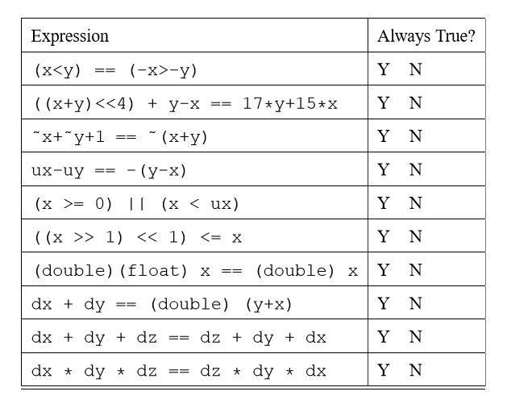

# Homework1
519030910245 余北辰

**1.	假定机器M的时钟频率为1.2GHz，某程序P在机器M上的执行时间为12秒钟。对P优化时，将其所有的乘4指令都换成了一条左移2位的指令，得到优化后的程序P’。已知在M上乘法指令的CPI为5，左移指令的CPI为2，P的执行时间是P’执行时间的1.2倍，则P中有多少条乘法指令被替换成了左移指令被执行？**

$CPU_{time}(P') =12s/1.2 =10s$
$\Delta CPU_{time} = 12s-10s=2s$
因此有$CPI_{\times}*N/clockrate - CPI_{<<}*N/clockrate=\Delta CPU_{time}=2s$
即$N=1.2G*2/(5-2)=0.8G=800M$，P中有800M条乘法指令被替换成了左移指令被执行。

**2.	图形处理器中经常需要的一种转换是求平方根。浮点（FP）平方根的实现在性能方面有很大差异，特别是在为图形设计的处理器中，尤为明显。假设FP平方根（FPSQR）占用一项关键图形基准测试中30%的执行时间。有一项提议：升级FPSQR硬件，使这一运算速度提高到原来的10倍。另一项提议是让图形处理器中所有FP指令的运行速度提高到原来的1.6倍，FP指令占用该应用程序一半的执行时间。设计团队相信，他们使所有FP指令执行速度提高到1.6倍所需要的工作量与加快平方根运算的工作量相同。试比较这两种设计方案。**

假设升级FPSQR硬件记为选择A，改进FP指令记为选择B,我们比较二者的加速比:

$$SPEEDUP_A = \frac{1}{(1-0.3)+\frac{0.3}{10}}=1.37$$

$$SPEEDUP_B = \frac{1}{(1-0.5)+\frac{0.3}{1.6}}=1.23$$

选择A的加速比高于选择B，因此升级FPSQR硬件是更好的选择。

**3.	假设我们在对有符号值使用补码运算的32位机器上运行代码。对于有符号值使用的是算术右移，对无符号值使用的是逻辑右移。变量的声明和初始化如下：**

    int x = foo(); //调用某某函数，给x赋值
    int y = bar(); //调用某某函数，给y赋值
    unsigned ux = x;
    unsigned uy = y;

**对于下面每个C表达式
证明对于所有的x和y 值，都为真（等于1）；或者（2）给出使得它为假的x和y值；**
**A.	(x>0) || (x-1<0)**
**B.	(x&7) != 7 || (x<<29<0)**
**C.	(x * x) >= 0**
**D.	x<0 || -x<=0**
**E.	x>0 || -x>=0**
**F.	x+y == uy+ux**
**G.	x\*~y + uy\*ux == -x**
**H.	x\*4 + y\*8 == (x<<2)+(y<<3)**
**I.	((x>>2)<<2)<=x**

_A._
false
x = -2147483648，x>0为false；
x-1 = 2147483647，x-1<0为false。

_B._
true
7的二进制表示为111
如果(x&7) != 7不成立，那么x必然是......111的形式，即x的低三位全为1；那么左移29位后x的符号位为1，所表示的值也就必然小于0了。

_C._
false
存在乘法溢出，因此只要x\*x的二进制编码的第32位为1，被截断后x\*x就小于零了。

_D._
true
32位的int的范围是-2147483648~2147483647,每一个正数都有其对应的负数。

_E._
false
32位的int的范围是-2147483648~2147483647,-2147483648没有其对应的正数，取反加一后仍为其本身。

_F._
true
int 和 unsigned int共用一套加法器，因此相加后得到的编码是相同的；而int转换为unsigned int时，并不改变编码，只是对编码重新解释，因此二者是相等的。

_G._
true
int 和 unsigned int共用加法器和乘法器且类型转换时编码不变，故x*(-y) = ux*(-uy)；又\~y = -y-1，x*~y = x*(-y-1) = x*(-y)-x，故原式成立。

_H._
true
左移时，左移n位就等于乘以2的n次方

_I._
true
先右移两位，再左移两位，相当于把低2位置零。而无论正数还是负数，得到的值都小于或等于原数

**4.	假定在一个程序中定义了变量x、y和i，其中，x和y是float型变量（用IEEE754单精度浮点数表示），i是16位short型变量（用补码表示）。程序执行到某一时刻，x = –0.125、y=7.5、i=100，它们都被写到了主存（按字节编址），其地址分别是100，108和112。请分别画出在大端机器和小端机器上变量x、y和i在内存的存放位置。**

x = -0.125 = -0.001B = -1.0 \* 2^-3^ B，32位单精度浮点数编码为10111110000000000000000000000000，即BE000000
y = 7.5 = 111.1B = 1.111 \* 2^2^ B，32位单精度浮点数编码为01000000111100000000000000000000，即40F00000
i = 100，32位补码为00000000000000000000000001100100，即00000064

大端机器上，先排高位字节：
100 BE
101 00
102 00
104 00
108 40
109 F0
110 00
111 00
112 00
113 00
114 00
115 64

小端机器上，先排低位字节：
100 00
101 00
102 00 
104 BE
108 00
109 00
110 F0
111 40
112 64
113 00
114 00
115 00

**5.	We are running programs on a machine with the following characteristics:
Values of type int are 32 bits. They are represented in two’s complement, and they are right shifted arithmetically. Values of type unsigned are 32 bits.
Values of type float are represented using the 32-bit IEEE floating point format, while values of type double use the 64-bit IEEE floating point format.
We generate arbitrary values x, y, and z, and convert them to other forms as follows:**

    /* Create some arbitrary values */ 
    int x = random();
    int y = random();
    int z = random();
    /* Convert to other forms */ 
    unsigned ux = (unsigned) x; 
    unsigned uy = (unsigned) y; 
    double dx = (double) x;
    double dy = (double) y;
    double dz = (double) z;

**For each of the following C expressions, you are to indicate whether or not the expression always yields 1. If so, circle “Y”. If not, circle “N” and tell why.**
 

_Expression 1._
N
x = -2147483648，y = -2147483647
x < y，而-x = -2147483648 < -y = 2147483647

_Expression 2._
Y
((x+y)<<4) + y-x == 17\*y+15\*x
即(x+y)*4 + y-x == 17\*y+15\*x
显然成立

_Expression 3._
Y
\~x= -x-1, \~y= -y-1
\~x+\~y+1 = -x-1+ -y-1+1 = -(x+y)-1 = \~(x+y)
故成立

_Expression 4._
Y
int 和 unsigned int 共用加法器，而且减法和加法都是使用同一套加法器实现的，而且类型转换时，不改变编码，而只是对编码进行重新解释。因此左右两个式子得到的结果完全相同。

_Expression 5._
N
x < ux 是重言式，因为二者比较时会发生类型转换，x会转换为无符号整型，与ux是相同的，因此 x==ux 恒成立。所以当x < 0时，该表达式为假。

_Expression 6._
Y
先右移1位，再左移1位，相当于把最低位置零。而无论正数还是负数，得到的值都小于或等于原数。

_Expression 7._
N
int有效位数是31位，float小数有效位为23位，double小数有效位是52位。
int转double不会有问题，而转float可能会发生精度丢失的问题。

_Expression 8._
N
整数加法溢出后会改变符号位，而浮点数加法不会，因此该式不成立。

_Expression 9._
N
有效位相差较大时发生截断。
dx = -1.5\*10^38^，dy = 1.5\*10^38^，dz = 1.0
dx + dy + dz = 1.0 != dz + dy + dx = 0.0

_Expression 10._
N
乘法过程中会产生上溢，dx, dy, dz都是由int转换而来，有效位数最多是31位；两两相乘时，得到的数最多有62位，比double的52位有效位要多，这里产生的上溢可能会导致误差。