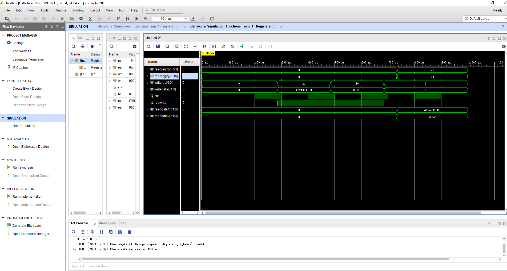
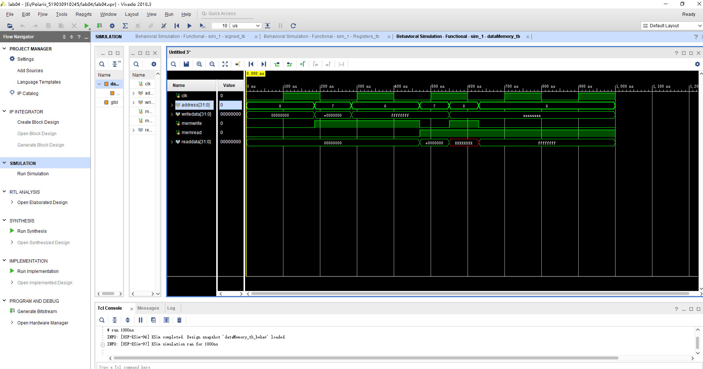
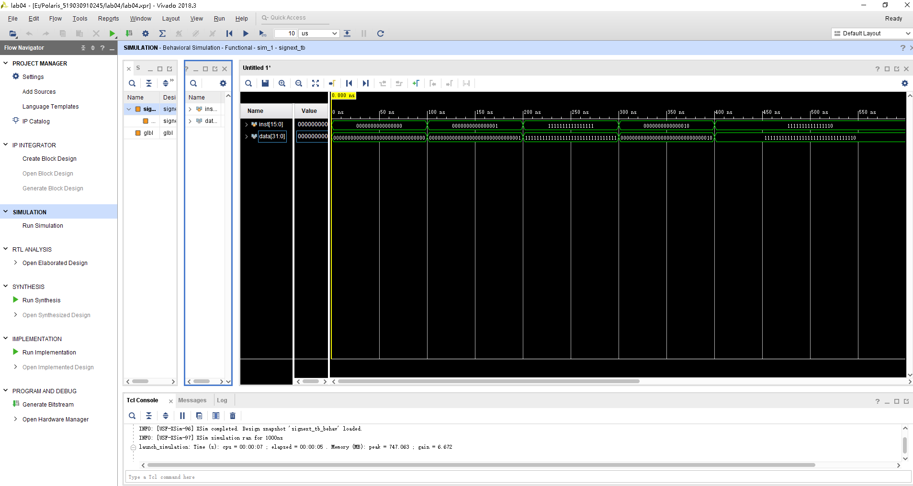

# Lab04 实验报告

余北辰 519030910245

[TOC]

## 1 概述

### 1.1 实验名称

简单的类MIPS单周期处理器实现 –寄存器、存储器与有符号扩展

### 1.2 实验目的

1. 理解 CPU 的寄存器、存储器、有符号扩展 
2. Register 的实现 
3. Data Memory 的实现 
4. 有符号扩展的实现 
5. 使用行为仿真


## 2 寄存器模块

### 2.1 模块描述

寄存器是CPU内部用来存放数据的一些小型存储区域，用来暂时存放参与运算的数据和运算结果，是指令操作的主要对象。32位的MIPS中共有32个32位寄存器。

### 2.2 模块实现过程

我们要实现的是寄存器的读写操作。

寄存器的写操作是时序逻辑，在时钟信号Clk的下降沿处，当检测到RegWrite信号时，进行写操作。注意0号寄存器的值恒为0，因此对0号寄存器的写操作应该被忽略。

```v
 always @ (negedge clk)
        begin
            if(regwrite && writereg != 0)
                regfile[writereg] = writedata;
        end
```

而读操作则不同，只要检测到ReadReg信号就可以读寄存器的值。在写寄存器后，也应该更新ReadData的值。

```v
    always @ (readreg1 or readreg2 or writereg)
        begin
            if(readreg1)
                readdata1 = regfile[readreg1];
            else 
                readdata1 = 0;
            if(readreg2)
                readdata2 = regfile[readreg2];
            else
                readdata2 = 0;
        end
```

### 2.3 仿真激励测试

初始时，将所有的信号全部置0；控制Clk信号，使其每100ms发生改变。

分别检测寄存器的写操作和读操作是否正常工作。

```v
always #100 clk = 1 - clk;

initial begin
    clk = 0;
    readreg1 = 0;
    readreg2 = 0;
    writereg = 0;
    writedata = 0;
    regwrite = 0;
    
    #100;
    clk = 0;
    
    #185;
    regwrite = 1'b1;
    writereg = 5'b10101;
    writedata = 32'b11111111111111110000000000000000;
    
    #200;
    writereg = 5'b01010;
    writedata = 32'b00000000000000001111111111111111;
    
    #200;
    regwrite = 1'b0;
    writereg = 5'b00000;
    writedata = 32'b00000000000000000000000000000000;
    
    #50;
    readreg1 = 5'b10101;
    readreg2 = 5'b01010;

end
```

### 2.4 测试结果



经观察，控制信号的波形与指导书的描述一致。该模块实现成功。


## 3 内存单元模块

### 3.1 模块描述

内存单元模块就是RAM，是计算机硬件的一个重要部件，其作用是存放指令和数据，并能由CPU直接随机存取。

### 3.2 模块实现过程

与寄存器模块类似，在写内存时，我们使用时序逻辑，在Clk的下降沿处统一进行写操作。

```v
always @ (negedge clk)
        begin
            if(memwrite)
            begin
                memfile[address] = writedata;
            end
        end
```

在检测到MemRead信号时读取内存中的数据。注意模块中的地址发生变化时，也应该相应更新读取的数据。

```v
    always @ (memread or address)
        begin
             if(memread)
                readdata = memfile[address]; 
             else
                readdata = 0;
        end
```

### 3.3 仿真激励测试

与寄存器模块类似，初始时，将所有的信号全部置0；控制Clk信号，使其每100ms发生改变。

分别检查内存单元的读写操作是否正常。

```v
always #100 clk = 1 - clk;

initial begin

clk = 0;
address = 0;
writedata = 0;
memwrite = 0;
memread = 0;

#185;
memwrite = 1'b1;
address = 32'b00000000000000000000000000000111;
writedata = 32'b11100000000000000000000000000000;

#100;
memwrite = 1'b1;
writedata = 32'hffffffff;
address = 32'b00000000000000000000000000000110;

#185;
memread = 1'b1;
memwrite = 1'b0;
address = 32'b00000000000000000000000000000111;

#80;
memwrite = 1;
address = 8;
writedata = 32'haaaaaaaa;

#80;
memwrite = 0;
memread = 1;
address = 32'b00000000000000000000000000000110;


end
```

### 3.4 测试结果



说明：在MemRead和MemWrite信号都为1时，由于读内存操作是组合逻辑，此时该地址处尚未写入数据，因此输出结果为XXXXXXXX是合理的。

经观察，控制信号的波形与指导书的描述一致。该模块实现成功。


## 4 符号扩展模块

### 4.1 模块描述

该模块将16位有符号数通过符号扩展，扩展为32位有符号数。

### 4.2 模块实现过程

该模块较前两个模块简单许多，属于组合逻辑。这里使用assign语句，将输入的数经过符号扩展后不断赋给输出的结果。

符号扩展的方法也很简单，只要检查输入的有符号数的最高位。当其为1时，输出结果的高16位全为1，否则全为0。

```v
    assign data = (inst[15] == 1) ? (inst|32'hffff0000) : (inst|32'h00000000);  
```

### 4.3 仿真激励测试

分别输入最高位为0和1的带符号数，检查输出的正确性。

```v
    initial begin
    
    inst = 0;
    #100;
    inst = 16'b0000000000000001;
    #100;
    inst = 16'b1111111111111111;
    #100;
    inst = 16'b0000000000000010;
    #100;
    inst = 16'b1111111111111110;
    
    
    end
```

### 4.4 测试结果



经观察，控制信号的波形与指导书的描述一致。该模块实现成功。


## 5 实验总结

1. 与lab3不同，Ctr和Alu都是组合逻辑模块，而寄存器和内存单元模块在写入数据的时候是时序逻辑的。因此，写操作时要与时钟信号相关联，每次都在时钟下降沿执行写入操作。
2. 在内存模块仿真测试时，我的结果与实验指导书上的结果略有不同，在MemRead和MemWrite信号都为1时我的结果是红色的“XXXXXXXX”，而指导书上是绿色的”00000000“。经过思考后，我判断是我没有将内存的DataFile初始化为0所致的不同。
3. 在之后的实验中了解到，对数据的写入应该使用“<=”进行非阻塞赋值，允许其他的Verilog语句同时进行操作。在之后的实验中，我对这里的代码进行了改正。

