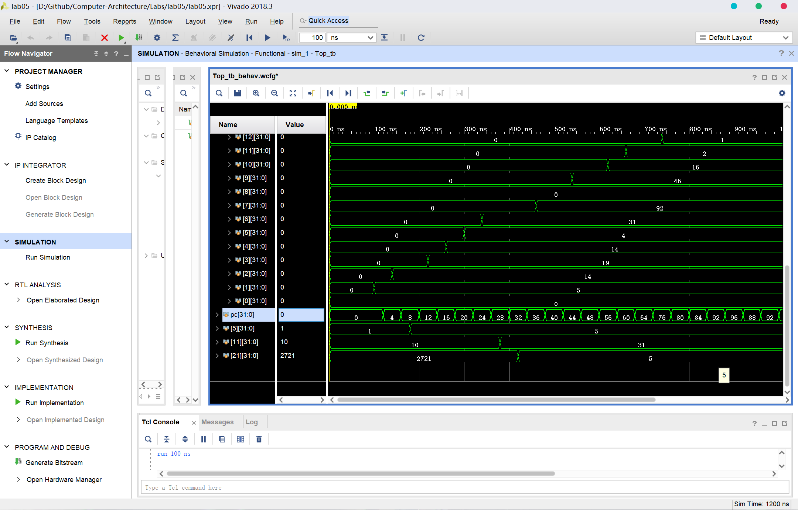
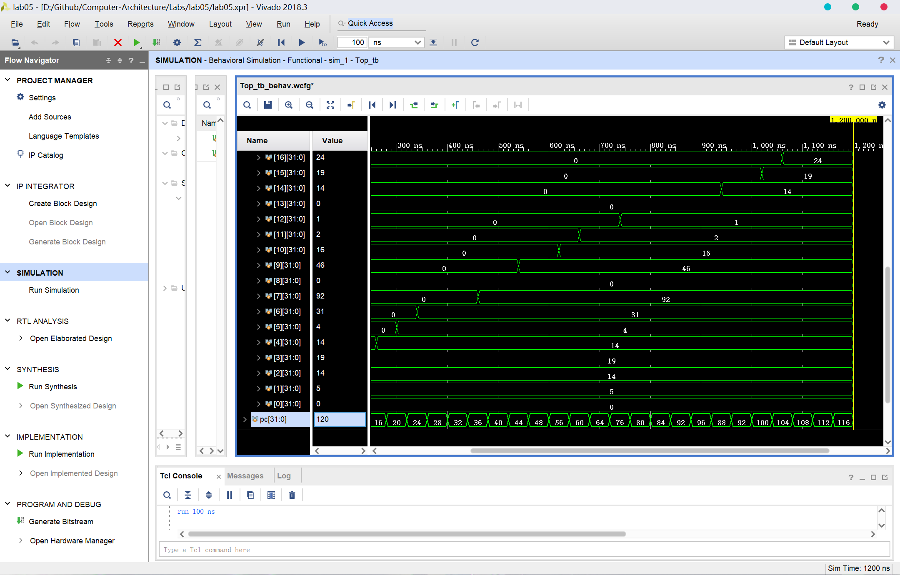

# lab05 实验报告

余北辰 519030910245

[TOC]

## 1 概述

### 1.1 实验名称

类MIPS单周期处理器的设计与实现

### 1.2 实验目的

1. 完成单周期的类MIPS处理器
2. 在之前的基础上，设计支持 16 条MIPS 指令（add, sub, and, or, addi, andi, ori, slt, lw, sw, beq, j, jal, jr, sll, srl）的单周期 CPU


## 2 指令分析

本次实验要求在原有的9条指令的基础上，扩展至16条指令。对于这16条指令，我们首先进行分析，并据此判断对之前的各模块所应做的修改。

### 2.1 已完成的指令

包括 add, sub, and, or, lw, sw, slt, jump 和 beq，共9条指令。

这些指令使用之前编写的模块就能实现。

### 2.2 立即数相关指令

包括 addi，andi 和 ori，共3条指令。

这些指令首先进行立即数的扩展，再将扩展后的立即数作为ALU运算单元的第二个操作数。注意其中addi进行的是符号扩展，而andi和ori则为零扩展。

这些需要我们添加额外的部件模块，对ALU运算单元的第二个操作数的来源进行选择。

### 2.3 移位相关指令

包括 sll 和 srl，共两条指令。

这两条指令涉及到shamt，也就是指令的第6-10位。在其它指令中，指令的第6-10位都为零。

这两套指令将rt寄存器中的值左移或右移shamt位后，存入rd寄存器中。

这些需要我们判断一条指令是否属于移位指令，以提取shamt的值，并添加额外的部件模块，对ALU运算单元的第一个操作数的来源进行选择。

### 2.4 跳转相关指令

除了已经完成的jump指令外，还有jr和jal，共2条待完善的指令。

jr指令需要读取寄存器，将所读取的数据作为跳转的地址。

jal指令则是在jump的基础上将当前PC的值加4后写入$31寄存器。

这需要我们判断指令是否属于跳转相关指令、属于哪种跳转指令，并且分情况进行操作。


## 3 顶层模块设计

在顶层模块中，我们需要对之前lab3和lab4中实现的各个模块进行实例化，并且通过信号线将这些模块按照数据通路连接起来。

首先，我们先要完成指令存储模块和多路选择器模块的构建。

### 3.1 指令存储模块

下面是指令存储模块的代码实现：

```v
reg [31:0] instruction;
reg [31:0] instfile[31:0];

always @ (readaddress)
    begin
      instruction = instfile[readaddress/4];        
    end
```

在MIP架构中，指令存储器按字节寻址，一个指令占据四个地址的存储空间。因此取指时，取得的指令的条目编号为PC的值除以4。

### 3.2 多路选择器模块

在多路选择器模块中，分别有两路输入信号和一路选择信号，要得到一路输出信号。实现方法也较为简单，只要用三目运算符即可实现。注意到实验中分别需要两种多路选择器（5位和32位），需要分别实现。

32位多路选择器（用作选择数据）：

```v
module Mux(
    input [31:0] input0,
    input [31:0] input1,
    input sel,
    output [31:0] out
    );
    
    assign out = sel ? input1 : input0;

endmodule
```

5位多路选择器（用做选择寄存器的编号）：

```v
module Mux_(
    input [4:0] input1,
    input [4:0] input0,
    input sel,
    output [4:0] out
    );
    
    assign out = sel ? input1 : input0;

endmodule
```

在多路选择器模块中，sel信号为0代表选择input0作为输出结果，为1代表选择input1作为输出结果。

### 3.3 对原有模块的修改

为了实现新扩展的指令的功能，对原有的模块需要进行一定的修改：

#### 寄存器模块

添加reset信号，在clk信号下降沿处检查reset信号，若为1则将所有寄存器清零。

```v
always @ (negedge clk)
        begin
            if(RESET)
             	begin
            		for(i=0;i<32;i=i+1)
                		regfile[i]=0;
             	end
        end
```

#### Ctr模块

2位的ALUop此时已经不够用，应该扩展至3位，代表ALU中不同的操作；

添加jal信号，以确定jump后是否需要将PC+4写到$31寄存器；

添加signext信号，以确定发生符号扩展还是零扩展。

```v
module Ctr(
    input [5:0] OpCode,
    output reg RegDst,
    output reg AlUSrc,
    output reg MemToReg,
    output reg RegWrite,
    output reg MemRead,
    output reg MemWrite,
    output reg Branch,
    output reg [2:0] ALUOp,
    output reg Jump,
    output reg Jal,
    output reg signext
    ); 
```

因篇幅过长，对于OpCode译码的具体实现见Ctr.v代码，实验报告中不另行叙述。

#### ALUctr模块

添加shamt信号，判断指令是否是移位指令；

添加jr信号，判断指令是否为jr指令；

```v
module Aluctr(
    input [2:0] ALUOp,
    input [5:0] Funct,
    output reg [3:0] AluCtrOut,
    output reg Shamt,
    output reg Jr
    );
```

因篇幅过长，对于Aluctr和funct的译码的具体实现见Aluctr.v代码，实验报告中不另行叙述。

#### ALU模块

添加左移和右移的功能：

```v
        4'b0011://ls
            begin
            alures = input2 << input1;
            if(alures == 0)
                zero = 1;
            else 
                zero = 0;
            end     
        4'b0100://rs
            begin
            alures = input2 >> input1;
            if(alures == 0)
                zero = 1;
            else 
                zero = 0;
            end 
```

#### signext模块

添加signext的输入信号，判断是进行符号扩展还是零扩展：

```v
module signext(
    input signext,
    input [15:0] inst,
    output [31:0] data
    );
    
    assign data = signext ? {(inst[15] == 1) ? (inst|32'hffff0000) : (inst|32'h00000000)} : (inst|32'h00000000);   
endmodule
```

### 3.4 各模块的实例化与连接

#### 取指

先定义初始的一些信号线和PC寄存器：

```v
reg[31:0] pc;
wire[31:0] inst;
wire regdst;
wire jump;
wire branch;
wire memread;
wire memtoreg;
wire[2:0] aluop;
wire memwrite;
wire alusrc;
wire regwrite;
wire jal;
wire signext;
wire shamt;
wire jr;
```

再利用定义好的指令寄存器模块取指：

```v
 InstMemory instmemory(
    .readaddress(pc),
    .instruction(inst)
);
```

#### 译码

利用Ctr模块，对OpCode，也就是取得指令的第31-26位进行译码：

```v
Ctr mainctr(
    .OpCode(inst[31:26]),
    .RegDst(regdst),
    .Jump(jump),
    .Branch(branch),
    .MemRead(memread),
    .MemToReg(memtoreg),
    .ALUOp(aluop),
    .MemWrite(memwrite),
    .AlUSrc(alusrc),
    .RegWrite(regwrite),
    .Jal(jal),
    .signext(signext)
);
```

#### 寄存器的读写

对于所写的寄存器的选择，其一是要判断是要写rd还是rt；其二是要判断是否是jal指令，如果是的话就应该写$31寄存器：

```v
Mux_ regdst_mux(
    .input0(inst[20:16]),
    .input1(inst[15:11]),
    .sel(regdst),
    .out(writereg_tmp)
);

Mux_ jal_reg_mux(
    .input0(writereg_tmp),
    .input1(5'b11111),
    .sel(jal),
    .out(writereg)
);
```

利用之前实现的寄存器模块进行实例化：

```v
wire[31:0] readdata1;
wire[31:0] readdata2;
wire[31:0] writedata;
wire[4:0] writereg_tmp;
wire[4:0] writereg;

Registers registers(
    .clk(clk),
    .RESET(RESET),
    .readdata1(readdata1),
    .readdata2(readdata2),
    .writedata(writedata),
    .readreg1(inst[25:21]),
    .readreg2(inst[20:16]),
    .writereg(writereg),
    .regwrite(regwrite & (~jr))
);
```

这里要注意虽然jr指令是R型指令，译码得到的regwrite为1，但是其是不写寄存器的，应该单独处理。

#### 运算

在实现逻辑运算功能前，先要处理aluctr译码和位扩展：

```v
wire[3:0] aluctrout; 
Aluctr aluctr(
    .Shamt(shamt),
    .Jr(jr),
    .Funct(inst[5:0]),
    .ALUOp(aluop),
    .AluCtrOut(aluctrout)
);

wire[31:0] extopout;
signext extop(
    .signext(signext),
    .inst(inst[15:0]),
    .data(extopout)
);
```

对ALU单元的两个输入数据的来源，需要进行选择：

input1的来源，需要判断是否是移位指令，从而选择是shamt的值还是rs寄存器中的数据：

```v
wire [31:0] shamtout;
Mux shamt_mux(
    .input1({27'b00000000000000000000,inst[10:6]}),
    .input0(readdata1),
    .sel(shamt),
    .out(shamtout)
);
```

input2的来源，需要判断是位扩展的结果，还是rt寄存器中的数据：

```v
wire[31:0] alusourceout;
Mux alusource_mux(
    .input1(extopout),
    .input0(readdata2),
    .sel(alusrc),
    .out(alusourceout)
);
```

再利用之前实现的ALU模块进行实例化：

```v
wire[31:0] alures;
Alu alu(
    .aluctr(aluctrout),
    .input1(shamtout),
    .input2(alusourceout),
    .zero(zero),
    .alures(alures)
);
```

#### 存储单元的读写

利用之前实现的内存单元模块，进行实例化：

```v
wire[31:0] memreaddata;
dataMemory datamemory(
    .clk(clk),
    .address(alures),
    .writedata(readdata2),
    .memwrite(memwrite),
    .memread(memread),
    .readdata(memreaddata)
);
```

#### 写回数据的选择

完成存储单元的读写后，需要从ALU的结果和内存读取结果中，选择写寄存器的数据，还要考虑jal的情况，最终确定writedata的来源：

```v
wire[31:0] writedata_tmp;
Mux memtoreg_mux(
    .input0(alures),
    .input1(memreaddata),
    .sel(memtoreg),
    .out(writedata_tmp)
);

Mux jal_mux(
    .input1(pc + 4),
    .input0(writedata_tmp),
    .sel(jal),
    .out(writedata)
);
```

#### 跳转逻辑的处理

首先计算出三个可能跳转的地址，加上jr其实一共应该有四个可能的目标地址。

```v
assign pc_plus_4 = pc + 4;
assign jump_address = {pc_plus_4[31:28],inst[25:0],2'b00};
assign branch_address = pc_plus_4 + {extopout,2'b00};
```

首先判断是否为branch：使用多路选择器，当指令为beq且ALU的计算结果为0时输出branch_address，否则输出PC+4

```v
Mux branch_mux(
    .input0(pc_plus_4),
    .input1(branch_address),
    .sel(branch & zero),
    .out(branch_out)
);
```

其次判断是否为jump（或jal）：使用多路选择器，当指令为jump时输出jump_address，否则输出之前branch_mux的结果

```v
Mux jump_mux(
    .input0(branch_out),
    .input1(jump_address),
    .sel(jump),
    .out(jump_out)
);
```

最后判断是否为jr：使用多路选择器，当指令为jump时输出rs寄存器中的值，否则输出之前jump_mux的结果

```v
Mux jr_mux(
    .input0(jump_out),
    .input1(readdata1),
    .sel(jr),
    .out(nextpc)
);
```

最后我们得到的nextpc的值就是正确的地址了。在Clk的下降沿将PC用nextpc的值代替：

```v
always @ (posedge clk)
    begin
    if(RESET)
        pc <= 0;
    else
        pc <= nextpc;
    end
```

各模块的实例化与连接就此完成。

## 4 仿真激励测试

在进行仿真激励测试之前，需要首先编写instfile和memfile。

### 4.1 内存文件

用十六进制编码，编写内存文件。

```
00000005
0000000E
00000101
00000C02
00000CD6
00000001
0000040A
00000005
00000034
00000453
00000AAA
0000000A
00000F03
00000E0E
0000010D
00000EEF
00000A08
000000AB
0000000A
00000127
00000118
00000AA1
0000010A
000001FF
000002FF
0000034A
000004AF
0000022F
00000F4F
000007FF
0000080F
0000000F
```

### 4.2 指令文件

编写指令文件，其实就是自己用MIPS汇编语言设计一个程序，用来判断运行结果的正确性：

```v
10001100000000010000000000000000 //lw   $1, 0($0)     $1 = 5
10001100000000100000000000000001 //lw   $2, 1($0)     $2 = 14
10101100001000010000000000000000 //sw   $1, 0($1)     mem[5] = 5
00000000001000100001100000100000 //add  $3, $1, $2    $3 = 19
00000000011000010010000000100010 //sub  $4, $3, $1    $4 = 14
00000000001001000010100000100100 //and  $5, $1, $4    $5 = 4
00000000011001000011000000100101 //or   $6, $3, $4    $6 = 31
10101100101001100000000000000111 //sw   $6, 7($5)     mem[11] = 31
10101100011000010000000000000010 //sw   $1, 2($3)     mem[21] = 5
00100000001001110000000001010111 //addi $7, $1, 87    $7 = 92
00110000100010000000000000100000 //andi $8, $4, 32    $8 = 0
00110100100010010000000000100000 //ori  $9, $4, 32    $9 = 46
00010000010001000000000000000001 //beq  $2, $4, 1     go to line 14(pc = 56)
00000000001000100001100000100000 //add  $3, $1, $2    omitted
00000000000001010101000010000000 //sll  $10, $5, 2    $10 = 16
00000000000001010101100001000010 //srl  $11, $5, 1    $11 = 2
00001000000000000000000000010011 //jump 19            go to line 19(pc = 76)
00010000010001000000000000000001 //beq  $2, $4, 1     omitted
00000000001000100001100000100000 //add  $3, $1, $2    omitted
00000000001001000110000000101010 //slt  $12, $1, $4   $12 = 1
00000000001001010110100000101010 //slt  $13, $1, $5   $13 = 0
00001100000000000000000000010111 //jal  23            go to line 23(pc = 92);$31 = 88
00100000001011100000000000001001 //addi $14, $1, 9    $14 = 14 
00010001110000100000000000000001 //beq  $14, $2, 1    first time not jump;second time go to line 25(pc = 100)
00000011111000000000000000001000 //jr   $31           go to line 22(pc = 88)
00000000001011100111100000100000 //add  $15, $1, $14  $15 = 19
00000000001011111000000000100000 //add  $16, $1, $15  $16 = 24
```

在注释中，包括二进制编码所代表的汇编指令，以及这条指令运行的结果。

### 4.3 激励测试文件

```v
 initial begin
 #0;
 $readmemh("memfile.txt",top.datamemory.memfile);
 $readmemb("instfile.txt",top.instmemory.instfile);
 RESET = 1;
 clk = 1;
 #100;
 RESET = 0;
 #6000;
 end
 
 always #20 clk = ~clk;
```

每20ns，Clk的值改变一次；前100ns，RESET的值为1，之后RESET的值变为0，CPU正式开始工作。

\$readmemh和\$readmemb表示读取的内存文件和指令文件分别是十六进制的和二进制的。

### 4.4 测试结果





经观察，控制信号的波形与4.2节中预期的结果完全一致。类MIPS单周期处理器实现成功。

## 5 实验总结

1. 本次实验比前几次实验困难得多，前几次实验都是完成CPU的一个小部件，而该实验是涉及到一条指令的完整的CPU中数据通路的，对每一部分的细节有很高的要求，哪怕一个小地方出错都会导致最后结果与预期不符，需要花很多时间在调试上。
2. 本次实验要求将之前的9条指令扩展到16位，这导致之前写的几个模块都要在不同程度上进行改写，比如ALUop要由两位扩展到三位，这些在实验报告中都有叙述。这对模仿与修改、举一反三、触类旁通的能力提出了要求。
3. 本次试验的仿真需要自己写一份MIPS汇编代码。由于之前很少真正用汇编语言写代码，尤其是还要翻译为二进制代码，我在写的时候感觉非常吃力，花费了大量的时间才将16条指令全部囊括，尤其是涉及到跳转的部分感觉很容易弄混。这次实验之后，我对汇编语言代码也更加熟悉，编写汇编代码的能力也得到了提高。
4. 经过这次实验，对于计算机系统结构课堂上所学习的关于单周期处理器的数据通路等知识更加理解了，对具体细节的实现也更加有心得了。