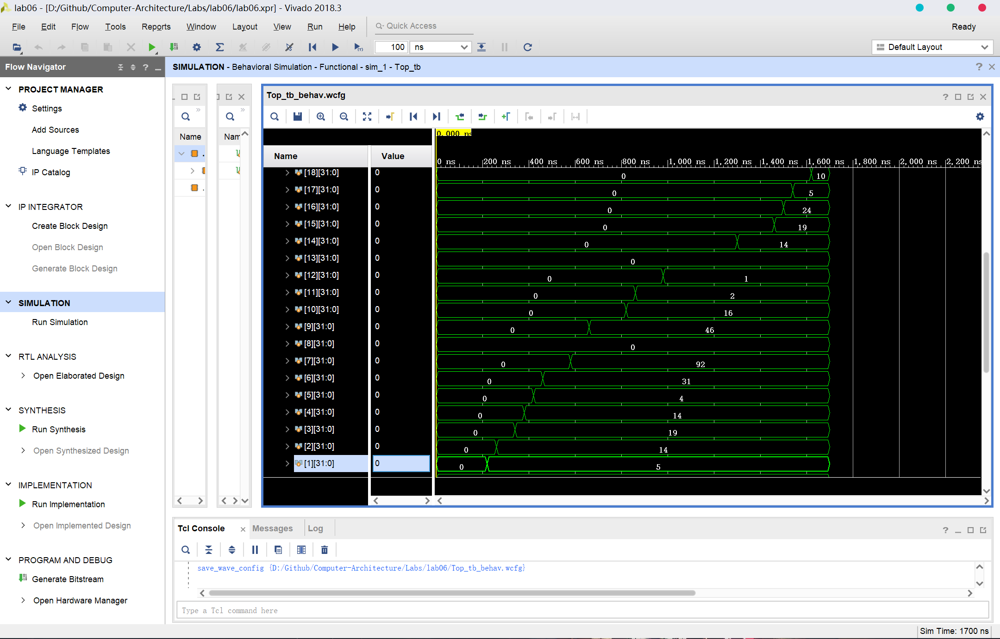
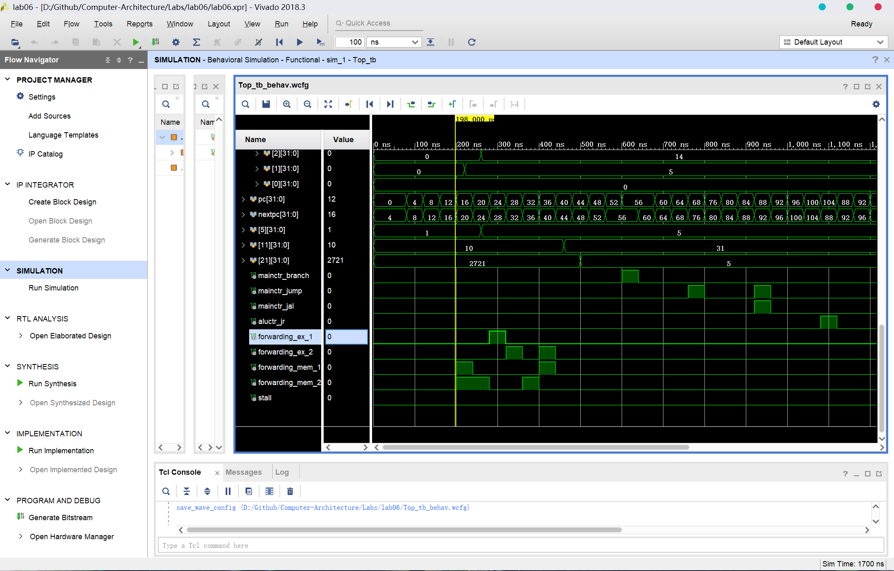
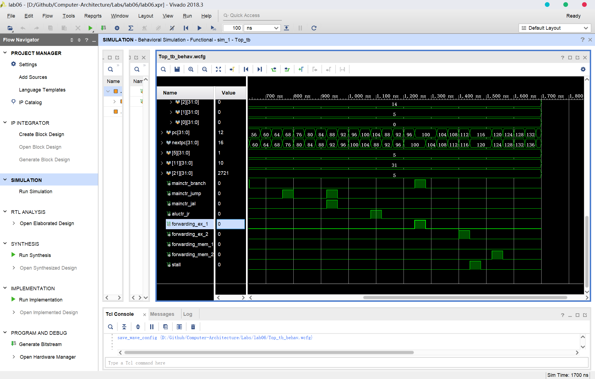

# lab06 实验报告

余北辰 519030910245

[TOC]

## 1 概述

### 1.1 实验名称

简单的类MIPS多周期流水线处理器设计与实现

### 1.2 实验目的

1. 理解CPU流水线，了解流水线冒险及相关性，设计基础流水线CPU。
2. 设计支持Stall的流水线CPU。通过检测竞争并插入停顿机制解决数据冒险、控制冒险和结构冒险。
3. 在2的基础上，增加Forwarding机制解决数据冒险，减少因数据冒险带来的流水线停顿延时，提高流水线处理器性能。
4. 在3的基础上，通过predict-not-taken策略解决控制冒险，减少控制冒险带来的流水线停顿延时，进一步提高处理器性能。

## 2 顶层模块设计

### 2.1 模块描述

为了实现处理器的多周期流水化作业，需要将流水线分成5个阶段，分别为：取指（IF）、译码（ID）、执行（EX）、访存（MEM）、写回（WB）。在每两个流水线阶段中间有段寄存器，用于存储前一个阶段所产生的信息，并提供给下一个阶段使用。

流水线的执行步骤大致包括：

1. 取指（IF）阶段：根据PC的值，从指令储存器中取出指令，计算当前PC+4的值，存到IF/ID寄存器中；
2. 译码（ID）阶段：对IF/ID寄存器中指令进行译码，得到各种控制信号；对寄存器进行读写操作；对指令低16位进行位扩展操作；将所得到的所有的信息全部分别储存在ID/EX寄存器中；
3. 执行（EX）阶段：根据ID/EX寄存器中的控制信号，确定ALU的两路输入数据的来源；将运算的结果，以及后续阶段所需的控制信号写入EX/MEM寄存器中；
4. 访存（MEM）阶段：根据EX/MEM寄存器中的控制信号以及所储存的地址，访问内存并将所得的结果与后续阶段所需的控制信号一并写入MEM/WB寄存器中；
5. 写回（WB）阶段：根据MEM/WB寄存器中的控制信号，确定是否要写寄存器。

此外，对于跳转，需要特殊化地进行处理。

对于数据冒险，采用forwarding的方式，设计前向通路规避冒险；而无法规避时，使用stall强制使得流水线停顿；

对于beq指令，采取predict-not-taken的策略；假设真的发生了跳转，则立刻将此时的各受影响的段寄存器清除（flush）。

### 2.2 段寄存器设计

如上所述，流水线CPU需要4种段寄存器作为支持。

IF/ID寄存器：

```v
    //IFID
    reg[31:0] ifid_pcplus4;
    reg[31:0] ifid_inst; 
```

ID/EX寄存器：

```v
    //IDEX
    reg[9:0] idex_ctr;
        //RegDst [9]
        //AlUSrc [8]
        //MemToReg [7]
        //RegWrite [6]
        //MemRead [5]
        //MemWrite [4]
        //Branch [3]
        //ALUOp [2:0]
    reg idex_jump;
    reg[31:0] idex_pcplus4;
    reg[31:0] idex_imm;
    reg[31:0] idex_readdata1,idex_readdata2;
    reg[4:0] idex_readreg1,idex_readreg2,idex_writereg;
```

EX/MEM寄存器：

```v
	//EXMEM
    reg[4:0] exmem_ctr;
        //MemToReg [4]
        //RegWrite [3]
        //MemRead [2]
        //MemWrite [1]
        //Branch [0]
    reg exmem_zero;
    reg[31:0] exmem_aluout, exmem_branch, exmem_writedata;
    reg[4:0] exmem_writereg;
```

MEM/WB寄存器：

```v
    //MEMWB
    reg[1:0] memwb_ctr;
        //MemToReg [1]
        //RegWrite [0]
    reg[31:0] memwb_aluout, memwb_memout, memwb_writedata;
    reg[4:0] memwb_writereg;
```

### 2.3 各阶段的实现

#### 信号线定义

```v
    wire stall；   
    wire[31:0] inst, pcplus4, nextpc, jump_address, branch_address, jr_address;
    wire mainctr_branch, mainctr_jump, mainctr_jal, aluctr_jr, aluctr_shamt;
    wire[9:0] mainctr_res;
    wire[31:0] alu_src_A, alu_src_B, alures, mem_writedata;
    wire[31:0] imm_signext;
    wire[4:0] regdstout, reg_writereg;
    wire[3:0] aluctrout;
    wire[31:0] branchout, jumpout;
    wire[31:0] reg_readdata1, reg_readdata2;
    wire[31:0] reg_writedata, mem_readdata, reg_final_writedata;
    wire zero;
```

#### 取指（IF）阶段

```v
//IF
    InstMemory instmemory(
        .readaddress(pc),
        .instruction(inst)
    );

    always @ (posedge clk)
    begin
        if (!RESET && !stall) 
        begin
        ifid_pcplus4 <= pcplus4;
        ifid_inst <= inst;
        pc <= nextpc;
        if(mainctr_branch || mainctr_jump || aluctr_jr )
            begin
                ifid_pcplus4 <= 0;
                ifid_inst <= 0;
            end
        end
    end    
```

首先，从指令储存器中根据PC的值取值；

接着将PC+4和指令储存在IF/ID段寄存器中。

对于stall和flush部分的内容到后面再叙述。

#### 译码（ID）阶段

```v
//ID
    Ctr mainctr(
        .OpCode(ifid_inst[31:26]),
        .RegDst(mainctr_res[9]),
        .AlUSrc(mainctr_res[8]),
        .MemToReg(mainctr_res[7]),
        .RegWrite(mainctr_res[6]),
        .MemRead(mainctr_res[5]),
        .MemWrite(mainctr_res[4]),
        .Branch(mainctr_res[3]),
        .ALUOp(mainctr_res[2:0]),
        .Jump(mainctr_jump),
        .Jal(mainctr_jal)
    );
    
    Mux_ regdstmux(
        .input0(ifid_inst[20:16]),
        .input1(ifid_inst[15:11]),
        .sel(mainctr_res[9]),
        .out(regdstout)
    );

    Mux_ jal_reg_mux(
        .input0(memwb_writereg),
        .input1(5'b11111),
        .sel(mainctr_jal),
        .out(reg_writereg)
    );

    Mux jal_data_mux(
        .input0(reg_writedata),
        .input1(ifid_pcplus4),
        .sel(mainctr_jal),
        .out(reg_final_writedata)
    );

    Registers registers(
        .RESET(RESET),
        .readreg1(ifid_inst[25:21]),
        .readreg2(ifid_inst[20:16]),
        .writereg(reg_writereg),
        .writedata(reg_final_writedata),
        .clk(clk),
        .regwrite(memwb_ctr[0]),
        .readdata1(reg_readdata1),
        .readdata2(reg_readdata2)
    );
    
    
    signext sign_ext(
        .inst(ifid_inst[15:0]),
        .data(imm_signext)
    );
   
    
    always @ (posedge clk)
    begin
        idex_jump <= mainctr_jump;
        idex_ctr <= mainctr_res;
        idex_pcplus4 <= ifid_pcplus4;
        idex_imm <= imm_signext;
        idex_readdata1 <= reg_readdata1;
        idex_readdata2 <= reg_readdata2;
        idex_readreg1 <= ifid_inst[25:21];
        idex_readreg2 <= ifid_inst[20:16];
        idex_writereg <= regdstout;
        if (mainctr_branch || mainctr_jump || aluctr_jr || stall) begin
            idex_jump <= 0;
            idex_ctr <= 0;
            idex_pcplus4 <= 0;
            idex_imm <= 0;
            idex_readdata1 <= 0;
            idex_readdata2 <= 0;
            idex_readreg1 <= 0;
            idex_readreg2 <= 0;
            idex_writereg <= 0;
        end
    end
```

首先，从IF/ID寄存器中获得OpCode并进行译码，得到各控制信号；

再使用多路选择器，选择写操作的目标寄存器以及写操作的数据来源；

利用寄存器模块，实现寄存器的读写操作；

利用位扩展模块，实现位扩展操作；

再将后续阶段所需要的信息储存到ID/EX寄存器。

对于stall和flush部分的内容到后面再叙述。

#### 执行（EX）阶段

```v
//EX
    Aluctr aluctr(
        .ALUOp(idex_ctr[2:0]),
        .Funct(idex_imm[5:0]),
        .AluCtrOut(aluctrout),
        .Jr(aluctr_jr),
        .Shamt(aluctr_shamt)
    );   
    
    assign alu_src_A = forwarding_ex_1 ? exmem_aluout : forwarding_mem_1 ? reg_writedata : aluctr_shamt ? {27'b00000000000000000000000000,idex_imm[10:6]} : idex_readdata1;
    assign alu_src_B =  idex_ctr[8] ? idex_imm : forwarding_ex_2 ? exmem_aluout : forwarding_mem_2 ? reg_writedata : idex_readdata2;
    assign mem_writedata = forwarding_ex_2 ? exmem_aluout : forwarding_mem_2 ? reg_writedata : idex_readdata2; 
    
    
    Alu alu(
        .aluctr(aluctrout),
        .input1(alu_src_A),
        .input2(alu_src_B),
        .zero(zero),
        .alures(alures)
    );

    
    always @ (posedge clk)
    begin
        exmem_zero <= zero;
        exmem_aluout <= alures;
        exmem_writereg <= idex_writereg;
        exmem_writedata <= mem_writedata;
        exmem_ctr <= idex_ctr[7:3];
        exmem_branch <= mainctr_branch;
    end
```

首先，从ID/EX寄存器中获得ALUop和Funct，送入ALUctr中进行译码；

然后确定ALU的数据来源，是来自ID/EX寄存器还是前向通路（该部分在后文详细叙述）；

再将数据送入ALU中进行运算；

最后将后续阶段所需要的信息储存到EX/MEM寄存器。

#### 访存（MEM）阶段

```v
//MEM
	dataMemory datamem(
        .clk(clk),
        .address(exmem_aluout),
        .writedata(exmem_writedata),
        .memwrite(exmem_ctr[1]),
        .memread(exmem_ctr[2]),
        .readdata(mem_readdata)
    );
    
    always @ (posedge clk)
    begin
        memwb_ctr <= exmem_ctr[4:3];
        memwb_aluout <= exmem_aluout;
        memwb_memout <= mem_readdata;
        memwb_writereg <= exmem_writereg;
    end
```

首先，从ID/EX寄存器中获得ALU的运算结果以及相应的控制信号，并使用内存单元读取所需访问的数据；

再将后续阶段所需要的信息储存到MEM/WB寄存器。

#### 写回（WB）阶段

```v
 Mux memtoregmux(
        .input0(memwb_aluout),
        .input1(memwb_memout),
        .sel(memwb_ctr[1]),
        .out(reg_writedata)
    );
```

使用多路选择器，选择写回的数据是来自ALU的计算结果还是来自访问内存的结果。

### 2.4 各功能的实现

#### PC更新功能

```v
//PC calculate
    assign jump_address = {ifid_pcplus4[31:28],ifid_inst[25:0],2'b00};
    assign branch_address = idex_pcplus4 + {idex_imm,2'b00};
    assign jr_address = idex_readdata1;

    assign mainctr_branch = idex_ctr[3] & zero;

   
    Mux branchmux(
        .input0(pcplus4),
        .input1(branch_address),
        .sel(mainctr_branch),
        .out(branchout)
    );
    
    Mux jumpmux(
        .input0(branchout),
        .input1(jump_address),
        .sel(mainctr_jump),
        .out(jumpout)
    );

    Mux jrmux(
        .input0(jumpout),
        .input1(jr_address),
        .sel(aluctr_jr),
        .out(nextpc)
    );
```

PC的更新一共有五种可能，分别是正常的PC+4，以及jump,jal,jr和beq导致的PC更新。

先计算出如果发生跳转，将会跳转到达的位置；再通过多路选择器，对PC进行选择，确定nextpc的值。

#### 前向通路功能

```v
	wire forwarding_ex_1;
    wire forwarding_ex_2;
    wire forwarding_mem_1;
    wire forwarding_mem_2;

    assign forwarding_ex_1 = exmem_ctr[3] & exmem_writereg != 0 & (exmem_writereg == idex_readreg1);
    assign forwarding_ex_2 = exmem_ctr[3] & exmem_writereg != 0 & (exmem_writereg == idex_readreg2);
    assign forwarding_mem_1 = memwb_ctr[0] & memwb_writereg != 0 & (memwb_writereg == idex_readreg1);
    assign forwarding_mem_2 = memwb_ctr[0]  & memwb_writereg != 0 & (memwb_writereg == idex_readreg2);
```

我们一共需要两条前向通路：

其一是当EX阶段结束后，发现将要写的寄存器恰是后面要读的寄存器；或是MEM阶段结束后，发现将要写的寄存器恰是后面要读的寄存器。由于读寄存器时，rs和rt都可能与要写的寄存器相重合，因此一共需要四个forwarding信号。

```v
	assign alu_src_A = forwarding_ex_1 ? exmem_aluout : forwarding_mem_1 ? reg_writedata : aluctr_shamt ? {27'b00000000000000000000000000,idex_imm[10:6]} : idex_readdata1;
    assign alu_src_B =  idex_ctr[8] ? idex_imm : forwarding_ex_2 ? exmem_aluout : forwarding_mem_2 ? reg_writedata : idex_readdata2;
```

之后，在EX阶段选择ALU数据来源时，需判断forwarding信号。若forwarding_ex信号为1，则数据来源应选择之前的ALU的输出结果，其储存在EX/MEM寄存器中；若forwarding_mem信号为1，则数据来源应选择之前的写入寄存器的数据，其储存在MEM/WB寄存器中。

这样，我们实现了前向通路功能，消除了除了”访存-使用“之外的数据冒险。

#### 流水线停顿功能

”访存-使用“数据冒险无法通过前向通路来解决，只能使流水线停顿一个周期。

```v
assign stall = idex_ctr[5] && (ifid_inst[25:21] == idex_readreg2 | ifid_inst[20:16] == idex_readreg2);
```

当IF/ID寄存器中的rs或rd寄存器与ID/EX寄存器中一致时，需要流水线停顿。

停顿操作较为简单，如上面2.3节中，将段寄存器的值置零即可。

#### 预测不转移功能

在流水线运行时，PC被自动先设置为PC+4而进入取指阶段，以提高流水线效率。这就是”预测不转移“。而如果此时发生了条件跳转，就需要将流水线清空。

```v
assign mainctr_branch = idex_ctr[3] & zero;
```

当ID/EX寄存器储存的branch信号为1，且ALU的计算结果为0，说明条件跳转发生，需要将流水线清空。

流水线清空的操作和停顿的操作类似，如上面2.3节中，将段寄存器的值置零即可。由于nextpc的值已经更新，下一次取指时会取得正确的地址。

此外，由于流水线的jump、jr指令没有提前判断，因此也需要把流水线清空。

#### 重置功能

当接受到RESET信号时，应当把流水线清空，把所有段寄存器置零：

```v
always @ (posedge clk)
    begin
        if(RESET)
        begin
            pc <= 0;
            ifid_inst <= 0;
            ifid_pcplus4 <= 0;
            idex_ctr <= 0;
            idex_imm <= 0;
            idex_jump <= 0;
            idex_pcplus4 <= 0;
            idex_readdata1 <= 0;
            idex_readdata2 <= 0;
            idex_readreg1 <= 0;
            idex_readreg2 <= 0;
            idex_writereg <= 0;
            exmem_aluout <= 0;
            exmem_branch <= 0;
            exmem_ctr <= 0;
            exmem_writedata <= 0;
            exmem_writereg <= 0;
            exmem_zero <= 0;
            memwb_aluout <= 0;
            memwb_ctr <= 0;
            memwb_memout <= 0;
            memwb_writereg <= 0;
        end
```

至此，顶层模块的所有功能实现完毕。

## 3 仿真激励测试

在进行仿真激励测试之前，需要首先编写instfile和memfile。

### 3.1 内存文件

用十六进制编码，编写内存文件。本实验采用的内存文件与lab5中完全相同。

```c++
00000005
0000000E
00000101
00000C02
00000CD6
00000001
0000040A
00000005
00000034
00000453
00000AAA
0000000A
00000F03
00000E0E
0000010D
00000EEF
00000A08
000000AB
0000000A
00000127
00000118
00000AA1
0000010A
000001FF
000002FF
0000034A
000004AF
0000022F
00000F4F
000007FF
0000080F
0000000F
```

### 3.2 指令文件

编写指令文件，其实就是自己用MIPS汇编语言设计一个程序，用来判断运行结果的正确性。

本实验的指令文件在lab5的基础上修改，在文件末尾增加了两条指令，用来测试对”访存-使用“数据冒险的处理情况。

```v
10001100000000010000000000000000 //lw   $1, 0($0)     $1 = 5
10001100000000100000000000000001 //lw   $2, 1($0)     $2 = 14
10101100001000010000000000000000 //sw   $1, 0($1)     mem[5] = 5
00000000001000100001100000100000 //add  $3, $1, $2    $3 = 19
00000000011000010010000000100010 //sub  $4, $3, $1    $4 = 14
00000000001001000010100000100100 //and  $5, $1, $4    $5 = 4
00000000011001000011000000100101 //or   $6, $3, $4    $6 = 31
10101100101001100000000000000111 //sw   $6, 7($5)     mem[11] = 31
10101100011000010000000000000010 //sw   $1, 2($3)     mem[21] = 5
00100000001001110000000001010111 //addi $7, $1, 87    $7 = 92
00110000100010000000000000100000 //andi $8, $4, 32    $8 = 0
00110100100010010000000000100000 //ori  $9, $4, 32    $9 = 46
00010000010001000000000000000001 //beq  $2, $4, 1     go to line 14(pc = 56)
00000000001000100001100000100000 //add  $3, $1, $2    omitted
00000000000001010101000010000000 //sll  $10, $5, 2    $10 = 16
00000000000001010101100001000010 //srl  $11, $5, 1    $11 = 2
00001000000000000000000000010011 //j    19            go to line 19(pc = 76)
00010000010001000000000000000001 //beq  $2, $4, 1     omitted
00000000001000100001100000100000 //add  $3, $1, $2    omitted
00000000001001000110000000101010 //slt  $12, $1, $4   $12 = 1
00000000001001010110100000101010 //slt  $13, $1, $5   $13 = 0
00001100000000000000000000010111 //jal  23            go to line 23(pc = 92);  $31 = 88
00100000001011100000000000001001 //addi $14, $1, 9    $14 = 14 
00010001110000100000000000000001 //beq  $14, $2, 1    first time not jump; second time go to line 25(pc = 100)
00000011111000000000000000001000 //jr   $31           go to line 22(pc = 88)
00000000001011100111100000100000 //add  $15, $1, $14  $15 = 19
00000000001011111000000000100000 //add  $16, $1, $15  $16 = 24
10001100101100010000000000000001 //lw   $17, 1($5)    $17 = 5
00000000001100011001000000100000 //add  $18, $1, $17  $18 = 10
```

### 3.3 激励测试文件

```v
module Top_tb(
    );
    
 reg clk;
 reg RESET;
 
 Top top(
    .clk(clk),
    .RESET(RESET)
 );
 
 
 initial begin
 #0;
 $readmemh("memfile.txt",top.datamem.memfile);
 $readmemb("instfile.txt",top.instmemory.instfile);
 RESET = 1;
 clk = 1;
 #80;
 RESET = 0;
 #6000;
 end
 
 always #20 clk = ~clk;
```

本实验的激励文件和lab5完全相同。

每20ns，Clk的值改变一次；前100ns，RESET的值为1，之后RESET的值变为0，CPU正式开始工作。

\$readmemh和\$readmemb表示读取的内存文件和指令文件分别是十六进制的和二进制的。

### 3.4 测试结果

先检查各个寄存器的结果是否符合预期：



各寄存器的最终的值与3.2节中预期的结果完全一致。


再检查stall，forwarding和跳转的情况：





stall，四种forwarding，以及跳转的地址，与3.2节中汇编代码对应的地址是相符的。

因此，控制信号的波形与预期的结果完全一致。简单的类MIPS多周期流水线处理器设计与实现顺利完成。

## 4 实验总结

1. 以lab3、4、5为基础，本实验实现了一个功能完整的、支持16条MIPS指令的多周期流水线处理器。通过前向通路、流水线停顿与清空、预测不转移等技术保证了该处理器的效率。通过本次实验，我对流水线的原理和各方面的细节有了更加深入的认识，自己动手实现流水线的过程，也让我对这些知识的掌握趋于实际。
2. 本实验的寄存器繁多，各种信号也很多。理清头绪的方法一方面是正确命名，例如对于段寄存器严格添加前缀，对于各中间的信号尽量标明产生和作用的阶段；另一方面是尽量把一个阶段的寄存器、线路写在一起，并通过简单的注释来说明。
3. 本实验由于是多周期处理器，同一时间内有多条指令同时在运行，给调试造成了很大的困难。经过实践，我发现可以将段寄存器中某个数据（例如rs和rt寄存器）的波形表示出来，这样可以理清各个阶段到底是哪一条指令在运行，有利于提高调试的效率。
4. 本实验有很多待改进的地方。首先，本实验只实现了MIPS的16条指令，可以考虑扩展指令到31条，完善处理器的功能。其次，可以将非条件跳转指令在ID阶段就判断出来，避免无谓的流水线清空；此外，还可以对处理器加入中断和异常的处理。
5. 本次计算机体系结构课程到此结束了。感谢本次实验的指导老师和助教对我的帮助和指导，让我能够更好地理解课程内容、解决实验中碰到的问题。

