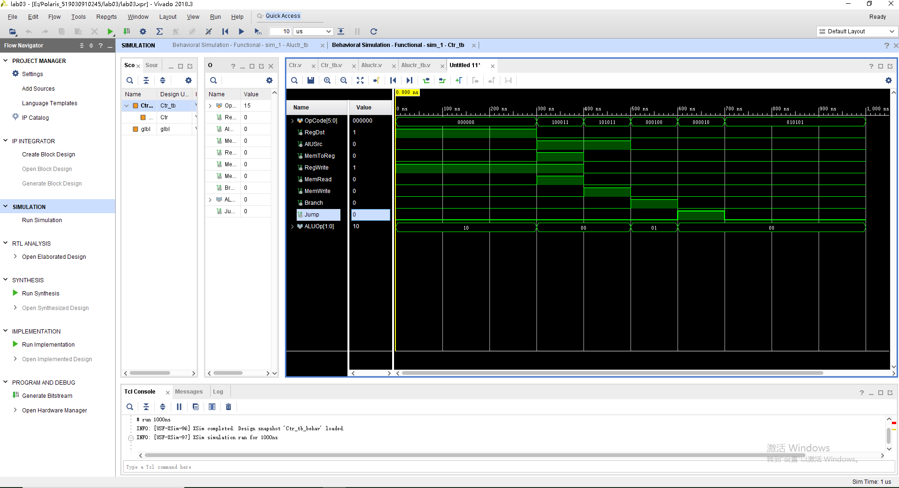
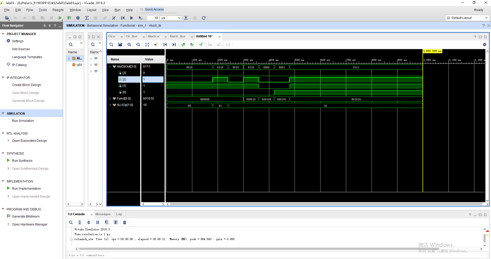
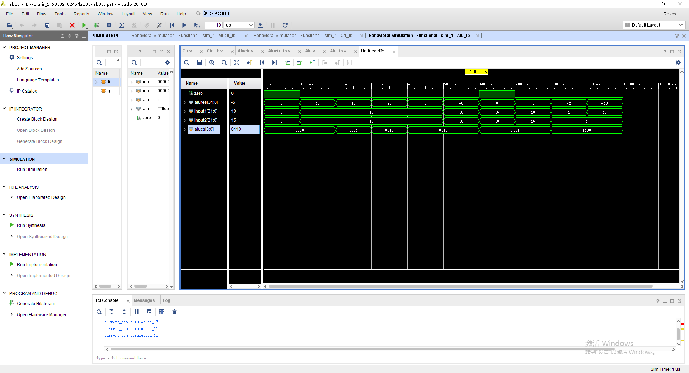

# Lab03 实验报告

余北辰 519030910245


## 1 概述

### 1.1 实验名称

简单的类 MIPS 单周期处理器部件实现 – 控制器，ALU

### 1.2 实验目的

1．理解 CPU 控制器和ALU 的原理

2．主控制器 Ctr 的实现 

3．运算单元控制器 ALUCtr 的实现 

4．ALU 的实现 

5．使用功能仿真


## 2 主控制器单元模块

### 2.1 模块描述

主控制器单元（Ctr）的输入为指令的 opCode 字段，操作码经过 Ctr 的译码，给 ALUCtr，Data Memory，Registers，Muxs 等部件输出正确的控制信号。

### 2.2 模块实现过程

首先确定译码器的输入为6位的OpCode，而输出分别为RegDst, AluSrc, MemToReg, RegWrite, MenRead, MenWrite, Branch, ALUOp 和Jump。

```v
module Ctr(
    input [5:0] OpCode,
    output RegDst,
    output AlUSrc,
    output MemToReg,
    output RegWrite,
    output MemRead,
    output MemWrite,
    output Branch,
    output [1:0] ALUOp,
    output Jump
    );
```

译码时，使用case语句对OpCode的值进行分类，再通过查阅真值表，确定输出信号的值。

OpCode为000000，为R-type，各输出信号的值如代码所示。

```v
always @(OpCode)
    begin
        case(OpCode)
        6'b000000:
        begin
            RegDst = 1;
            AlUSrc = 0;
            MemToReg = 0;
            RegWrite = 1;
            MemRead = 0;
            MemWrite = 0;
            Branch = 0;
            ALUOp = 2'b10;
            Jump = 0;
        end
```

OpCode为000100，为beq命令，各输出信号的值如代码所示。

```v
        6'b000100:
        begin
            RegDst = 0;
            AlUSrc = 0;
            MemToReg = 0;
            RegWrite = 0;
            MemRead = 0;
            MemWrite = 0;
            Branch = 1;
            ALUOp = 2'b01;
            Jump = 0;
        end
```

OpCode为100011，为lw命令，各输出信号的值如代码所示。

```v
        6'b100011:
        begin
            RegDst = 0;
            AlUSrc = 1;
            MemToReg = 1;
            RegWrite = 1;
            MemRead = 1;
            MemWrite = 0;
            Branch = 0;
            ALUOp = 2'b00;
            Jump = 0;
        end
```

OpCode为101011，为sw命令，各输出信号的值如代码所示。

```v
         6'b101011:
        begin
            RegDst = 0;
            AlUSrc = 1;
            MemToReg = 0;
            RegWrite = 0;
            MemRead = 0;
            MemWrite = 1;
            Branch = 0;
            ALUOp = 2'b00;
            Jump = 0;
        end
```

OpCode为000001，为jump命令，各输出信号的值如代码所示。

```v
        6'b000010:
        begin
            RegDst = 0;
            AlUSrc = 0;
            MemToReg = 0;
            RegWrite = 0;
            MemRead = 0;
            MemWrite = 0;
            Branch = 0;
            ALUOp = 2'b00;
            Jump = 1;
        end
```

### 2.3 仿真激励测试

仿真测试时，通过改变OpCode的值，观察各输出信号的变化。激励文件代码如下：

首先进行实例化：

```v
 	reg [5:0] OpCode;
    wire RegDst;
    wire AlUSrc;
    wire MemToReg;
    wire RegWrite;
    wire MemRead;
    wire MemWrite;
    wire Branch;
    wire [1:0] ALUOp;
    wire Jump;

    
    Ctr u0 (
        .OpCode(OpCode),
        .RegDst(RegDst),
        .AlUSrc(AlUSrc),
        .MemToReg(MemToReg),
        .RegWrite(RegWrite),
        .MemRead(MemRead),
        .MemWrite(MemWrite),
        .Branch(Branch),
        .Jump(Jump),
        .ALUOp(ALUOp)
    );
```

再依时改变OpCode的输入：

```v
 initial begin
   
    OpCode = 0;
    
    #100;
    
    #100 OpCode = 6'b000000;
    #100 OpCode = 6'b100011;
    #100 OpCode = 6'b101011;
    #100 OpCode = 6'b000100;
    #100 OpCode = 6'b000010;
    #100 OpCode = 6'b010101;

 end
```

### 2.4 测试结果



经观察，控制信号的波形与指导书的描述一致。该模块实现成功。


## 3 算术逻辑单元（ALU）控制器模块

### 3.1 模块描述

ALU 的控制器模块 （ALUCtr）是根据主控制器的 ALUOp 来判断指令类型。根据指令的后 6 位区分 R 型指令。综合这两种输入，控制 ALU 做正确的操作。

### 3.2 模块实现过程

ALUCtr模块的输入有1位的ALUOp，用以判断指令类型；以及6位的Funct，用于区分 R 型指令。

ALUCtr的输出有四位，直接输入到ALU中。

```v
module Aluctr(
    input [1:0] ALUOp,
    input [5:0] Funct,
    output [3:0] AluCtrOut
    );
```

同样使用case语句进行分类，使用{}（位拼接运算符）语法，按ALUOp和Funct的值的组合进行分类，并按照真值表确定模块的输出信号的值。该部分的代码如下：

```v
begin
    casex({ALUOp,Funct})
    
        8'b00000000: AluCtrOut = 4'b0010;        
        8'b10000000: AluCtrOut = 4'b0010;
        8'b10000010: AluCtrOut = 4'b0110;
        8'b10000100: AluCtrOut = 4'b0000;
        8'b10000101: AluCtrOut = 4'b0001;        
        8'b01000000: AluCtrOut = 4'b0110;        
        8'b10001010: AluCtrOut = 4'b0111;        

        default:     AluCtrOut = 4'b0000;
        
    endcase
end
```

### 3.3 仿真激励测试

首先进行实例化：

```v
    reg[5:0] Funct;
    reg[1:0] ALUOp;
    wire[3:0] AluCtrOut; 
    Aluctr u0(
        .Funct(Funct),
        .ALUOp(ALUOp),
        .AluCtrOut(AluCtrOut)
    );
```

再使用位拼接运算符，依时改变ALUOp和Funct的值。

```v
 initial begin
   
    {ALUOp,Funct} = 8'b00000000;
    
    #60 {Funct,ALUOp} = 8'b00000000;    
    #60 {Funct,ALUOp} = 8'b00000000;
    #60 {Funct,ALUOp} = 8'b00000001;
    #60 {Funct,ALUOp} = 8'b00000010;
    #60 {Funct,ALUOp} = 8'b00001010;
    #60 {Funct,ALUOp} = 8'b00010010;
    #60 {Funct,ALUOp} = 8'b00010110;
    #60 {Funct,ALUOp} = 8'b00101010;
    
 end
```

### 3.4 测试结果



经观察，控制信号的波形与指导书的描述一致。该模块实现成功。


## 4 算术逻辑单元(ALU)模块

### 4.1 模块描述

算术逻辑单元 ALU 根据 ALUCtr 信号将两个输入执行对应的操作，ALURes 为输出结果。 若做减法操作，当 ALURes 结果为 0 时，则 Zero 输出置为 1。

### 4.2 模块实现过程

根据 ALUCtr 信号的值，使用verilog语言的语法，对操作数进行相应运算。当运算结果为0时，将Zero的值置为1，其他的时候则令Zero为0。

输入信号为4位的ALUCtr，和两个32位的待运算的信号。输出信号包括32位的运算结果，以及一个Zero信号。

```v
module Alu(
    input [3:0] aluctr,
    input [31:0] input1,
    input [31:0] input2,
    output zero,
    output [31:0] alures
    );
```

使用case语句进行分类。

加法(add)的实现：

```v
4'b0010:
            begin
            alures = input1 + input2;
            end
```

减法(sub)的实现：

```v
4'b0110:
            begin
            alures = input1 - input2;
            if(alures == 0)
                zero = 1;
            else 
                zero = 0;
            end
```

按位与(and)的实现：

```v
4'b0000:
            begin
            alures = input1 & input2;
            if(alures == 0)
                zero = 1;
            else 
                zero = 0;
            end
```

按位或(or)的实现：

```v
4'b0001:
            begin
            alures = input1 | input2;
            if(alures == 0)
                zero = 1;
            else 
                zero = 0;
            end
```

按位或非(nor)的实现：

```v
4'b1100:
            begin
            alures = ~(input1 | input2);
            if(alures == 0)
                zero = 1;
            else 
                zero = 0;
            end
```

小于则置位(slt)的实现：

```v
4'b0111:
            begin
            if(input1 < input2)
                begin
                alures = 1;
                zero = 0;
                end
            else
                begin
                alures = 0;
                zero = 1;
                end
            end        
```

### 4.3 仿真激励测试

通过依时改变两个操作数以及操作码的值，观察输出波形的变化，以确认模块的功能是否正常。

```v
initial begin
    
    input1 = 0;
    input2 = 0;
    aluctr = 4'b0000;
    
    #100
    input1 = 15;
    input2 = 10;
    
    #100
    aluctr = 4'b0001;
    
    #100
    aluctr = 4'b0010;
    
    #100
    aluctr = 4'b0110;
    
    #100
    input1 = 10;
    input2 = 15;
    
    #100
    aluctr = 4'b0111;
    input1 = 15;
    input2 = 10;
    
    #100
    input1 = 10;
    input2 = 15;
    
    #100
    input1 = 1;
    input2 = 1;
    aluctr = 4'b1100;
    
    #100
    input1 = 16;
end
```

### 4.4 测试结果



经观察，控制信号的波形与指导书的描述一致。该模块实现成功。

## 5 实验总结

1. 本次实验着重于加强对verilog语言的进一步了解。前两个实验中，实验指导书的代码较为详细，主要是为了让我们熟悉vivado软件的使用；而本实验隐去了大多数的代码，而要求我们自己去完成，让我们逐步摆脱惯性思维，而对硬件描述语言更进一步了解。经过本实验，我对于硬件描述语言的模块化和逻辑结构有了更进一步的了解。
2. 本次试验中，我在对于reg和wire的声明时有所疏忽，导致出错而花费了而很多时间来排查错误。

